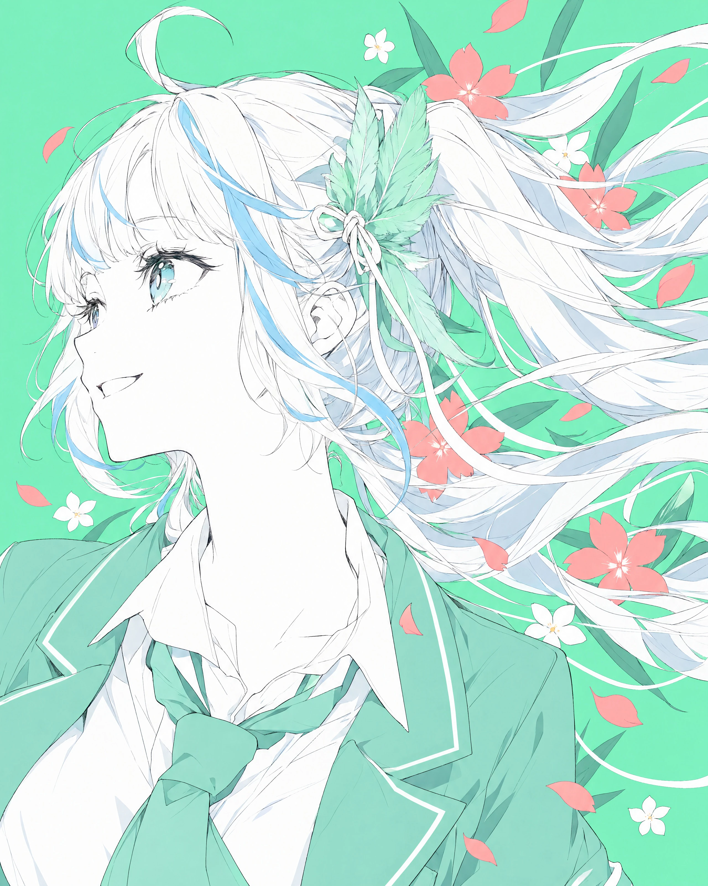
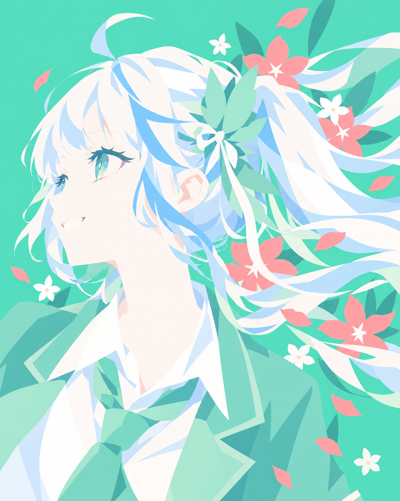
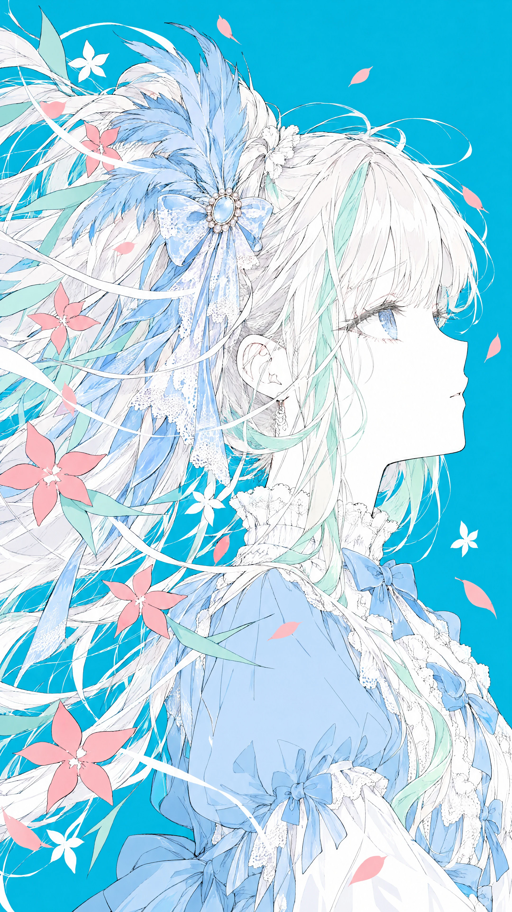
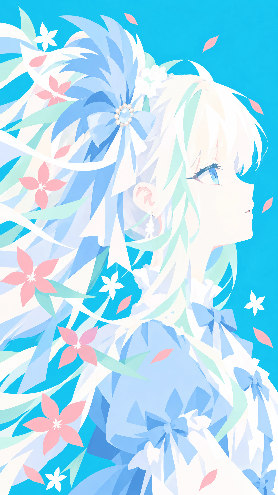

# Pureza 素

[简体中文](README-ZH.md)

### What is this for?

Pureza is a set of prompts for producing flat, minimalist, solid-color images.

### Before and after

| Original | Modified |
| :---: | :---: |
|  |  |

(Generated by GPT Image 2.5 Sunburst - Low Quality Level; this character is an original character, "Iris"; released under the CC BY-NC-SA 4.0 license.)

| Original | Modified |
| :---: | :---: |
|  |  |

(Generated by GPT Image 2.5 Sunburst - Low Quality Level; this character is an original character, "Lumi"; released under the CC BY-NC-SA 4.0 license.)

### Where do I use it?

Pureza works with AI image generation models that understand natural language. To use it, simply inject it into your prompt.

If your image generation model distinguishes between positive and negative prompts, keep an eye out for the upcoming "Bidirectional Prompts (for models such as Stable Diffusion and NovelAI)".

### In what situations is it best used?

I recommend using it when the image's colors tend toward strong complementary contrast, and when merging secondary colors into the dominant colors would not affect the result.

For the current version, it is best not to use this prompt during the initial generation stage. If you need one for the generation stage, a version of the prompt designed for that stage will be released later. The most recommended approach is to apply it in the final stage after several rounds of generation, or to use it on an image you already have.

For AI image generation models to pair with this prompt, I recommend GPT Image 2, GPT Image 2.5 Flare, and GPT Image 2.5 Sunburst.

I do not currently recommend models in the Nano Banana family. In testing, two of that family's flagship models (Nano Banana 2 and Nano Banana 2 Lite) produced severe color shift in certain cases, such as generation at medium-to-low quality settings. At high quality the colors are accurate, but the results are not good.

The ByteDance Seedream models have not been tested, so their behavior is currently unknown. Please use them with caution.

### On choosing the generation quality tier for image generation models

For the GPT Image series models, raising the image generation quality tier does not bring much benefit. In my experience, if you are using API access rather than a GPT subscription, I suggest choosing the Low tier to keep costs down. The Extra High and Max tiers do, however, slightly improve the texture.

For the Nano Banana series models, raising the generation quality can significantly reduce the color shift caused by color sampling.

### On the difference between Chinese and English prompts

In general, there is no difference between Chinese and English prompts. In some extreme cases, the Chinese prompt is recommended. Because of semantic drift in translated wording, the two prompts differ in some details. Specifically, the Chinese prompt produces images with a cleaner, crisper style and, for reasons unknown, samples colors more accurately. That said, in general there is no difference between the Chinese and English prompts.

### Prompt content (Chinese, single-image edit)

```
请把这张图（图一）按照下文规则修改。
不要使用墨线，请直接使用色块！保持主体在全图中心的位置和纯色背景。强化“尽可能使用色块表达、化繁为简”的中心思想。将原图使用的颜色自行总结成最少两种最多10种（请尽量往3种、5种、8种的档位上靠），重绘使用的颜色只能用刚才总结的这几种，重绘使用的颜色出现得越少越好，色块整合得越统一越好。
画面完全由图形构成，没有文字、数字、字母、签名或水印；没有第二个人物；背景不出现渐变、场景或地平线；不画夸张的腮红与油亮高光；不性感化；整体干净、通透、飘逸。
```

### Prompt content (English, single-image edit)

```
Please color and modify the main subject of this image (Image 1). Do not use ink outlines — use blocks of color directly. Keep the subject centered in the overall composition and keep a solid flat-color background. Reinforce the central principle: "express as much as possible through blocks of color; simplify the complex."
Summarize for yourself the colors used in the original image into no fewer than two and no more than ten (lean toward the tiers of 3, 5, or 8). The redraw may use only those summarized colors; the fewer times those colors appear, the better, and the more unified the merged color blocks, the better.
The image is composed entirely of shapes — no text, numbers, letters, signatures, or watermarks; no second figure; no gradients, scenery, or horizon line in the background; no exaggerated blush or glossy highlights; no sexualization; overall clean, luminous, and flowing.
```

### Author's note

I recommend against using this prompt to make commercial derivative modifications to an original image when you do not hold the copyright to it. This restriction carries no force — it is simply a suggestion from the author.

### TODO

- [ ] Universal skill
- [ ] Generation-stage prompt
- [ ] Bidirectional prompts
- [ ] Seedream testing

---

This prompt is released under the MIT open source license.

Original author: Kirarin
